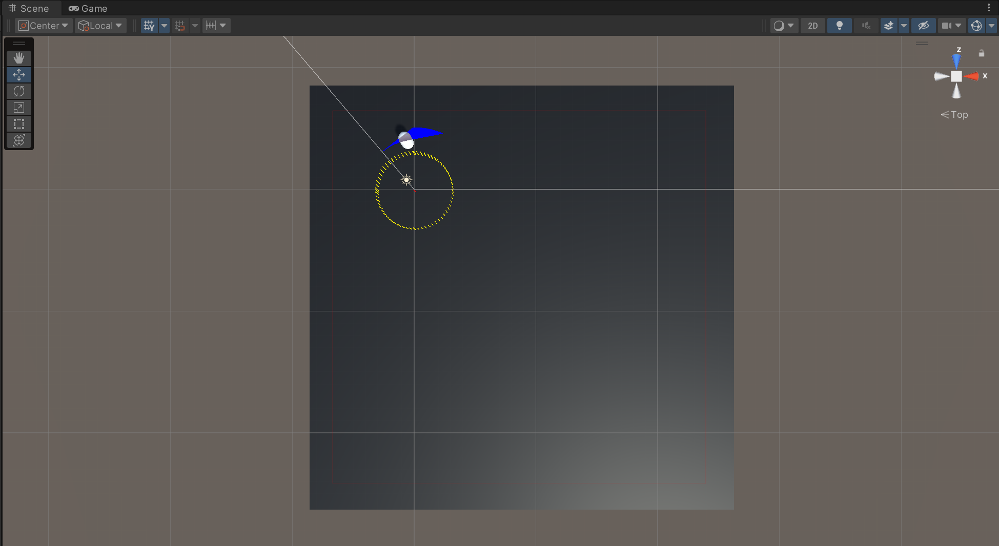

<div align="center">

# DrunkStride

</div>

This project is the assignment of the course "AI for videogames" at the University of Milan.

<div align="center">

| Assignment date | Deadline | Delivery date |
| :---: | :---: | :---: |
| 24/12/2023 | 18/01/2024 | 18/01/2024 |
</div>

<div align="center">

## Assignment text
</div>

### Goal
The goal of this project is to create an agent roaming on a platform while never moving along
a straight line.
### Setup
The platform can be of any size, square or rectangular.
The agent will change trajectory at random intervals. Each time the agent will travel over a
circumference leading first to right then to the left, then to the right again … and so on.
The agent is moving at a constant speed of 1 meter per second.
At each interval, the agent will pick a random value for the time to the next trajectory change
in the range (0, 10] seconds. Note that 0 is excluded.
Then, the agent selects a random circumference leading right or left with a radius between 0
(excluded) and the maximum radius that is not making the agent fall off the platform.
The selection of the radius is independent from the time of the next trajectory change.
The agent never stops moving.
### Constraints
The system must work independently on the platform shape or size.

<div align="center">

## Problem analysis
</div>

Summing up the assignment text, it is possible to identify the following constraints, divided by category:
### Movement
<ul>
    <li>The agent must move at a constant speed of 1 meter per second.</li>
    <li>The agent must move just along a circular line.</li>
    <li>The agent must move alternatively to the right/left each time the new trajectory is computed.</li>
    <li>The agent must never stop moving.</li>
    <li>The agent must never fall off/move oustside the platform.</li>
    <li>The range of values for the circle radius must be defined so that the agent do not overtake the platform.</li>
</ul>

### Events
<ul>
	<li>The random intervals to change the timer and the new trajectories computation must be mutually independent.</li>
    <li>The agent must change trajectory at random intervals in the range defined as ]0: 10].</li>
</ul>

### Platform        
<ul>
    <li>The agent must move on a rectangular or square platform of any size.</li>
</ul>

<div align="center">

## Adopted solution
</div>

### Overview
Basically, the used approach is based on two scripts: the `Movement` and `UI_Manager` classes where the former
controls the movement of a character in a 3D space while the latter manages the UI and the messages displayed on the screen 
when the simulation is running. A more detailed conceptual and technical analysis  is provided in  the following. 

## Movement class documentation


### Environment
To accomplish the task, an agent and a platform are required. A `CharacterController` component is used to move 
the character along a circular path on a platform, that is a plane randomly instantiated at the start of the game.
This and most of the code was developed in the `Movement.cs` script, which is analysed below.

### Methods and variables

#### Variables

<details>
<summary>Click here to show/hide the code for variables...</summary>
    <br>

    [Header("Agent")]
    private readonly float speed = 1f;
    private bool isMovingRight = true;
    private bool isBelow, isRight;
    private CapsuleCollider capsuleCollider;
    internal CharacterController chController;

    [Header("Events")]
    internal int changeTimerCounter = 0;
    internal float changeInterval;

    [Header("Circumference")]
    private Vector3[] circlePos;
    private float theta = 0;
    private float[] radians;
    private int validPoints;
    internal bool circleFound;
    internal Vector3 currentCenter;
    internal float radius;

    [Header("Platform")]
    private GameObject platform;
    private MeshCollider platformMeshCollider;
    private float minX, maxX, minZ, maxZ;
    private readonly Vector3[] vertices = new Vector3[4];
    internal Bounds platformBounds, resizedPlatformBounds;
    internal float minDistance, maxDistance;
    internal Vector3 closestVertex, furthestVertex;
    internal string closestVertexName, furthestVertexName;
    internal string[] vertexNames = new string[4];
</details>

Divided by category, the variables are related to the agent/character, to the events such as the computation of the next change time interval
in the random range of ] 0: 10], to the circumference and finally to the platform where the agent should move.
Since most of them are self-explanatory, the following will focus on the most important ones:
1. `isMovingRight`: boolean used to check if the agent is moving to the right or to the left, 
later exploited to make the agent move along `tangent/-tangent` direction.
2. `isBelow, isRight`: booleans used to check if the agent is below or right the center of the platform.
3. `circlePos[]`: array of the main points of a circle, used to check if it is entirely contained in the platform bounds.
4. `radians[]`: array containing the values in radiants of the points used to check if a "candidate" circle is inside/outside the platform.
5. `minX, maxX, minZ, maxZ`: floats used to store the minimum and maximum values of the x and z coordinates of the resized platform.
6. `vertices[]`: array containing the corners of the resized platform.
7. `minDistance, maxDistance`: floats used to store the distances between the agent and the closest/furthest platform corners.
    

#### Methods

- `Awake()`: here is instantiated a randomised plane that serves as the platform where the agent will move on. 
    
    ```
    private void Awake()
    {
        InstantiateRandomizedPlane();
    } 
    ```

    The plane randomisation is achieved thanks to: 
        
    
    - `InstantiateRandomizedPlane()`: it computes the external and internal bounds of the platform where the circular paths will be computed,
        exploiting a slightly smaller plane than the original one to prevent the agent from going outside of it.
        More specifically, it creates a new plane, assigns it a name, a tag, a mesh collider, a mesh renderer and colours it black. 
        
        Thus, since the platform is supposed to be the same during the whole simulation, the plane is made static.
        After that, the size and the position of the plane are randomized on different ranges and the references to the plane 
        and its collider are updated.
        In the end, the internal bounds of the resized platform are defined. These `resizedPlatformBounds` will be used to check 
        if the new circumferences will be contained in the platform or not.
        <details>
        <summary>Click here to show/hide the <code>InstantiateRandomizedPlane()</code> method...</summary>
            <br>
    
            public void InstantiateRandomizedPlane()
            {
                // Instantiate a new plane
                GameObject newPlane = GameObject.CreatePrimitive(PrimitiveType.Plane);
                newPlane.name = "Platform";
                newPlane.tag = "Floor";
                newPlane.isStatic = true;

                // Add a MeshCollider to the plane
                MeshCollider planeMeshCollider = newPlane.GetComponent<MeshCollider>();

                // Add a MeshRenderer to the plane and assign the BlackFloor material
                MeshRenderer planeMeshRenderer = newPlane.GetComponent<MeshRenderer>();
                planeMeshRenderer.material.color = Color.black;

                // Randomize plane size
                float planeSize = Random.Range(3f, 8f);
                newPlane.transform.localScale = new Vector3(planeSize, newPlane.transform.localScale.y, planeSize);

                // Randomize plane position
                float planePosX = Random.Range(-10f, 10f);
                float planePosZ = Random.Range(-10f, 10f);
                newPlane.transform.position = new Vector3(planePosX, newPlane.transform.position.y, planePosZ);

                // Update plane reference
                platform = newPlane;
                platformMeshCollider = planeMeshCollider;
                platformBounds = platformMeshCollider.bounds;

                // Update plane bounds
                resizedPlatformBounds = new Bounds(platform.transform.position, platform.transform.localScale * 10);
            }
        </details>                 
        
- `Start()`: initializes the `characterController` component, the collider of the capsule used as the agent and its position, placing it 
    to the center of the platform.

    ```
    private void Start()
    {        
        chController = GetComponent<CharacterController>();
        capsuleCollider = GetComponent<CapsuleCollider>();        
        chController.transform.position = platformBounds.center;
        GetClosestAndFurthestVertex();
    }
    ```

    Then, there is a call to:

    - `GetClosestAndFurthestVertex()`: first of all, it checks if the platform bounds are not null or empty, then it retrieves the minimum and maximum values for the x and z coordinates
        of the resized platform previously defined in the method that randomizes the platform. After that, the method creates an array of vertices 
        and their names for printing and debugging purposes in order to find the closest and furthest vertices from the agent.
        The result of these operations define the maximum acceptable radius for the new circular paths,
        which is the distance between the agent and the closest vertex.

        <details>
        <summary>Click here to show/hide <code>GetClosestAndFurthestVertex()</code> method...</summary>
            <br>

            public void GetClosestAndFurthestVertex()
            {
                if (platformBounds == null)
                {
                    Debug.LogError("platformBounds is null or empty.");
                    return;
                }

                minX = resizedPlatformBounds.min.x;
                maxX = resizedPlatformBounds.max.x;
                minZ = resizedPlatformBounds.min.z;
                maxZ = resizedPlatformBounds.max.z;

                vertices[0] = new Vector3(minX, resizedPlatformBounds.min.y, minZ); // bottom left
                vertices[1] = new Vector3(minX, resizedPlatformBounds.min.y, maxZ); // top left
                vertices[2] = new Vector3(maxX, resizedPlatformBounds.min.y, minZ); // bottom right
                vertices[3] = new Vector3(maxX, resizedPlatformBounds.min.y, maxZ); // top right

                vertexNames = new string[] { "bottom left", "top left", "bottom right", "top right" };

                minDistance = float.MaxValue;
                maxDistance = float.MinValue;

                for (int i = 0; i < vertices.Length; i++)
                {
                    float distance = Vector3.Distance(chController.transform.position, vertices[i]);
                    if (distance < minDistance)
                    {
                        minDistance = distance;
                        closestVertex = vertices[i];
                        closestVertexName = vertexNames[i];
                    }
                    if (distance > maxDistance)
                    {
                        maxDistance = distance;
                        furthestVertex = vertices[i];
                        furthestVertexName = vertexNames[i];
                    }
                }

                Debug.DrawRay(vertices[0], vertices[1] - vertices[0], Color.red, 3f);
                Debug.DrawRay(vertices[0], vertices[2] - vertices[0], Color.red, 3f);
                Debug.DrawRay(vertices[1], vertices[3] - vertices[1], Color.red, 3f);
                Debug.DrawRay(vertices[2], vertices[3] - vertices[2], Color.red, 3f);
            }
        </details>

- `Update()`: starts with the `changeInterval` variable update.
    Then, when the timer expires, the movement direction of the agent is changed through the boolean `isMovingRight`.

    ```
    void Update()
    {
        changeInterval -= Time.deltaTime;
        
        if (changeInterval <= 0)
        {
            isMovingRight = !isMovingRight;
            GetClosestAndFurthestVertex();
            WhereIsAgent();
            SetCirclePosition();
            SetNewChangeTime();
        }

        ChControllerMovement();
    } 
    ```

    From this point on, all methods in the `Movement` class are called and 
    that is why they will be illustrated in the following, accordingly to their calls order:
        
    - `GetClosestAndFurthestVertex()`: already described above.

    - `WhereIsAgent()`: launched to check on which side of the platform the agent is located because the new circular path takes in account this information
        for its computation. This is achieved by using two booleans which are set to true if the agent is below or right the center of the platform
        and followed by a debug line to internally test the right behaviour.

        ```
        private void WhereIsAgent() {
            isBelow = false;
            isRight = false;
            if (chController.transform.position.x > platformBounds.center.x) isRight = true;
            if (chController.transform.position.z < platformBounds.center.z) isBelow = true;
            Debug.Log($"Agent is {(isBelow ? "below" : "above")} and {(isRight ? "right" : "left")} the center of the platform.");
        }
        ```

    - `SetCirclePosition()`: this is the most important method of the script because it is responsible for the the new circle computation.
        It uses local variables to check if the maximum number of attempts to compute the new circle center is reached and to temporarily store the radius and the center 
        that will be eventually confirmed as definitive at the end of the loop, inserted in a `try-catch` statement to handle undesired behaviours. 

        <details>
        <summary>Click here to show/hide the <code>SetCirclePosition()</code> method...</summary>
            <br>


            void SetCirclePosition()
            {
                int maxAttempts = 1000;
                float tempRadius = 0;
                Vector3 newCircleCenter = Vector3.zero;
                circleFound = false;
                circlePos = new Vector3[4];

                if (circlePos == null || circlePos.Length == 0)
                {
                    Debug.LogError("circlePos array is null or empty.");
                    return;
                }

                try
                {
                    while (circleFound.Equals(false)) 
                    {
                        if (maxAttempts <= 0)
                        {
                            Debug.LogError("Max attempts reached! --> Moving along previous circle...");
                            return;
                        }
                        validPoints = 0;
                        tempRadius = Random.Range(0.1f, minDistance);
                        radians = new float[4] { 0, Mathf.PI / 2, Mathf.PI, 3 * Mathf.PI / 2 };
                        if (isBelow && isRight)
                        {
                            newCircleCenter = new Vector3(chController.transform.position.x - tempRadius,
                                                            chController.transform.position.y,
                                                            chController.transform.position.z + tempRadius);
                        }
                        else if (isBelow && !isRight)
                        {
                            newCircleCenter = new Vector3(chController.transform.position.x + tempRadius,
                                                            chController.transform.position.y,
                                                            chController.transform.position.z + tempRadius);
                        }
                        else if (!isBelow && isRight)
                        {
                            newCircleCenter = new Vector3(chController.transform.position.x - tempRadius,
                                                            chController.transform.position.y,
                                                            chController.transform.position.z - tempRadius);
                        }
                        else
                        {
                            newCircleCenter = new Vector3(chController.transform.position.x + tempRadius,
                                                            chController.transform.position.y,
                                                            chController.transform.position.z - tempRadius);
                        }

                        for (int i = 0; i < circlePos.Length; i++)
                        {
                            theta = radians[i];
                            circlePos[i] = newCircleCenter + new Vector3(tempRadius * Mathf.Cos(theta), 0, tempRadius * Mathf.Sin(theta));
                            if (resizedPlatformBounds.Contains(circlePos[i])) validPoints++;
                            if (validPoints == 4) circleFound = true;
                        }
                        maxAttempts--;
                    }
                    radius = tempRadius;
                    currentCenter = newCircleCenter;
                }
                catch (IndexOutOfRangeException e)
                {
                    Debug.LogError($"Index out of range in SetCirclePosition(): {e.Message}");
                }
                catch (Exception e)
                {
                    Debug.LogError($"Unexpected error in SetCirclePosition(): {e.Message}");
                }
            }
        </details>
        
        The method performs a check to control if the array of points `circlePos[i]` is not null or empty and then it enters in a while loop that is going to be executed until
        a valid circle is found or the maximum number of attempts is reached.
        Entering the loop if the starting conditions are satisfied, the method initializes the number of valid points to 0
        and the radius to a random value between 0.1 and the minimum distance computed in the `GetClosestAndFurthestVertex()` method.
		Then, it creates an array of angles `radians[4]`, corresponding to the angles (0°, 90°, 180°, 270°) that is
        used to check if these main points of the current "candidate" circle are all contained in the resized platform bounds.
        If so, the number of valid points is incremented and if it reaches 4, the circle is found and the loop is exited. 
        Otherwise, the maximum number of attempts is decremented and the loop continues until the circle is found or the maximum number of attempts is reached.
            
            
        It is worth noting that the new circle center is computed according to the quadrant of the platform where the agent is located 
        to prevent it from overtaking the platform bounds. This is realised by moving the coordinates of the new candidate center along (x, z) coordinates of the plane 
        and checking the previously mentioned booleans `isBelow, isRight`, according to the following scheme:

        <style>
            img {
                width: 40%;
                height: 50%;
                margin: 3px; 
            }
            figcaption {
                text-align: center;
            }
        </style>
        <figure align="center";>
            
            <figcaption><i>Figure 1: the computation of the new circle center position considers the platform's quadrant where the agent relies.</i></figcaption>
        </figure>

        If everything goes as expected, the radius and the center are updated and the method returns. If not and the maximum number of attempts is reached,
        the method returns the previous values of the radius and the center, avoiding an infinite loop condition.
    

    - `SetNewChangeTime()`: being called only when the timer expires, this method simply updates the timer for the next change and counts how many times it is expired.

		```
        private void SetNewChangeTime()
        {
            changeTimerCounter++;
            changeInterval = Random.Range(0.1f, 10f);
        }
        ```


    - `ChControllerMovement()`: at the end of the `Update()` method and at each frame, after all the computing operations have ended, the movement-related method is launched. 
        ```
        public void ChControllerMovement()
        {
            float duration = changeInterval;
            Vector3 origin = capsuleCollider.bounds.center;
            Vector3 dir = (currentCenter - chController.transform.position).normalized;
            Vector3 tangent = Vector3.Cross(dir, Vector3.up).normalized;
            Vector3 movementDirection = isMovingRight ? tangent : -tangent;
            chController.Move(speed * Time.deltaTime * movementDirection);
            DrawDebugRays(origin, duration, tangent, movementDirection);
        }
        ```
        It moves the agent on the platform and along the circular path found in the previous steps. Here is computed the movement direction of the character,
        considering the direction vector `dir` between him and the current circle center to obtain the final direction the agent will follow. 
        This direction named `tangent` is obtained through the cross product between `dir` and `Vector3.up`, i.e., the plane normal .

        After that, the movement direction can only be the tangent or its opposite, observing the constraint of moving alternatively to the right/left.
		Thus, the agent moves along the defined direction according to the already fixed speed of 1 m/s. 
            
        At the end of the method, some debug rays are drawn in the scene to check the correct behaviour of the agent through the:
        - `DrawDebugRays()`: it draws the tangent and the movement direction of the agent, corresponding to tangent/-tangent,
        the current circle trajectory to traverse and its center for the duration specified as parameter.
            
            ```
            private void DrawDebugRays(Vector3 origin, float duration, Vector3 tangent, Vector3 movementDirection)
            {
                Debug.DrawRay(origin, tangent * radius, Color.yellow, 2f); // Draw tangent
                Debug.DrawRay(origin, movementDirection * radius, Color.blue, 2f); // Draw movementDirection
                Debug.DrawRay(currentCenter, Vector3.up, Color.red, duration); // Draw current circle center
                for (int i = 0; i < circlePos.Length; i++)
                {
                    Debug.DrawRay(circlePos[i], Vector3.up, Color.yellow, duration);
                }
                for (theta = 0; theta < 2 * MathF.PI; theta += 0.1f) 
                { 
                Debug.DrawRay(currentCenter + new Vector3(radius * Mathf.Cos(theta), 0, radius * Mathf.Sin(theta)), Vector3.up, Color.yellow, duration);
                }
            }
            ```

            For a better understanding of rays debugging and the whole simulation, the following images show the agent in both scene and game views:
           
            <style>
            img {
                width: 60%;
                height: auto;
                margin: 5px; 
            }
            figcaption {
                text-align: center;
            }
            </style>

            <body>
            <figure align="center";>
                
                <figcaption><i>Figure 2: scene view displaying the debugged rays. Blue color is for movement direction while yellow for the tangent.</i></figcaption>
            </figure>

            <figure align="center";>
                
                <figcaption><i>Figure 3: the game view when the simulation runs, showing testing data because of the UIManager class.</i></figcaption>
            </figure>

            <figure align="center";>
                
                <figcaption><i>Figure 4: scene view where the yellow and blue rays overlap because the character is moving along the tangent direction.</i></figcaption>
            </figure>
            </body>

Now that the `Movement` class has been described, it is possible to move on to the `UIManager` class.		    

## UIManager class documentation

### Overview
The `UIManager` class is responsible for managing the user interface of the game.
It updates the UI based on the state of the `Movement` class results and data through a combination 
of button and text fields.

### Variables
There are few variables in this class, such as:

```
public Button warningButton;
public Text circleInfoText, timeRemainingText, closestFurthestVerText, warningText;
private Movement movement;
```
More specifically:

- `warningButton`: a button that is activated when the agent is outside the platform.
- `circleInfoText`: a text field that displays the minimum distance and radius of the circle.
- `timeRemainingText`: a text field that displays the remaining time and the number of times the timer has changed.
- `closestFurthestVerText`: a text field that displays the names of the closest and furthest vertices.
- `warningText`: a text field that displays a warning message when the agent is outside the platform.

- `movement`: reference to the `Movement` class which is kept as a private variable.

### Methods

- `Start()`: the `Movement` class is assigned to the `movement` variable.


    ```
    void Start()
    {
        movement = FindObjectOfType<Movement>();
    }
    ```
- `Update()`: the information displayed on the UI element is updated according to the computed results of the `Movement` class.

    <details>
    <summary>Click here to show/hide the <code>Update()</code> method...</summary>
    <br>

    
        void Update()
        {
            if (movement.circleFound)
            {
                circleInfoText.text = $"MinDistance: {movement.minDistance} \nRadius: {movement.radius}";
            }

            timeRemainingText.text = $"Time Remaining: {movement.changeInterval}\nTimer changed {movement.changeTimerCounter} times";       
            closestFurthestVerText.text = $"ClosestVer: {movement.closestVertexName}\nFurthestVer: {movement.furthestVertexName}";

            if (!movement.resizedPlatformBounds.Contains(movement.chController.transform.position))
            {
                warningButton.GetComponent<Image>().color = Color.black;
                warningButton.gameObject.SetActive(true);
                warningText.text = "Warning: The agent is outside the platform!";
            }
            else warningButton.gameObject.SetActive(false);        
        }
    </details>
    
    If the agent is outside the platform, the warning button is enabled and displays a warning message as can be seen below, otherwise it remains deactivated.
    <style>
        img {
            width: 80%;
            height: auto;
            margin: 5px; 
        }
        figcaption {
            text-align: center;
        }
    </style>
    <figure align="center";>
        
        <figcaption><i>Figure 5: game view displaying the warning message that the agent has overtaken the platform boundaries.</i></figcaption>
    </figure>

<div align="center">

## Summary
</div>

Finally, all the classes have been analysed, so it is worth having a recap of the whole project, summing up how the constraints have been satisfied.
In the problem analysis chapter, there were several constraints to be observed, so here is how they have been addressed in this solution:

### Movement
<div align="center">
<table>
  <tr>
    <th>Constraint</th>
    <th>Solution</th>
  </tr>
  <tr>
    <td><span style="color:red">The agent must move at a constant speed of 1 meter per second.</span></td>
    <td><span style="color:green">The speed of the agent is always equal to 1 m/s.</span></td>
  </tr>
  <tr>
    <td><span style="color:red">The agent must move just along a circular line.</span></td>
    <td><span style="color:green">Agent only moves along circular paths that are computed in a specific method.</span></td>
  </tr>
  <tr>
    <td><span style="color:red">The agent must move alternatively to the right/left each time the new trajectory is computed.</span></td>
    <td><span style="color:green">Accomplished through the use of the boolean `IsMovingRight` which changes the movement direction of the agent along the tangent/-tangent direction of the circle to follow and each time that a new circumference is computed and confirmed. </span></td>
  </tr>
  <tr>
    <td><span style="color:red">The agent must never stop moving.</span></td>
    <td><span style="color:green">The simulation never stops and so does the agent, even if the limit case of max attempts to find a new circle is occurring.</span></td>
  </tr>
  <tr>
    <td><span style="color:red">The agent must never fall off/move oustside the platform.</span></td>
    <td><span style="color:green">The computation of the new circular trajectories always checks whether or not the "candidate" circle is contained within the resized boundaries of the platform, ensuring that each final circular path is surely within those, if successfully found.</span></td>
  </tr>
  <tr>
    <td><span style="color:red">The range of values for the circle radius must be defined so that the agent do not overtake the platform.</span></td>
    <td><span style="color:green">The radius is always defined in the range [0.1: minDistance], where the minDistance is the distance between the agent and the closest corner of the platform.</span></td>
  </tr>
</table>
</div>

### Events
<div align="center">
<table>
  <tr>
    <th>Constraint</th>
    <th>Solution</th>
  </tr>
  <tr>
    <td><span style="color:red">The random intervals to change the timer and the new trajectories computation must be mutually independent.</span></td>
    <td><span style="color:green">The methods implementing these functions are separate and occur one after the other without any kind of mutual conditioning.</span></td>
  </tr>
  <tr>
    <td><span style="color:red">The agent must change trajectory at random intervals in the ]0: 10] range.</span></td>
    <td><span style="color:green">The mentioned range is [0.1 : 10].</span></td>
  </tr>
</table>
</div>

### Platform      
<div align="center">
<table>
  <tr>
    <th>Constraint</th>
    <th>Solution</th>
  </tr>
  <tr>
    <td><span style="color:red">The agent must move on a rectangular or square platform of any size.</span></td>
    <td><span style="color:green">The platform size and position randomisation at the beginning of the simulation grants the platform randomness, giving it a square or rectangular shape. 
    This ensures a dynamic and unpredictable environment for the simulation on each run.</span></td>
  </tr>
</table>
</div>
